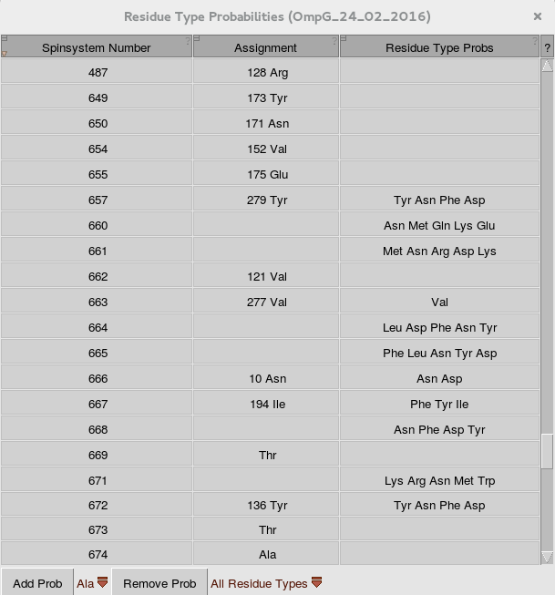

# Set the residueTypeProb field in the CCPNMR data model

This is a very simple [CCPNMR Analysis](http://www.ccpn.ac.uk/software/analysis) v2 plug-in that I use to set the 'residueTypeProb' attribute in my CCPNMR Analysis projects. [This field is present in the data model](http://www2.ccpn.ac.uk/api-documentation/ccpnmr/ccpnmr2.2/python/ccp/api/doc/nmr/Nmr/ResidueTypeProb/index.html), but can not be viewed or set anywhere in the Analysis GUI at the moment.

Every spin system in the project has this attribute and it can be used to remember the possible amino acid types this spin system could be assigned to. Normally you can assign a spin system to only one amino acid type. I find it very useful though to maintain a list of all possible amino acid type assignments while the assignment process is not finished yet. 

Especially when using amino acid specific isotope labeling schemes it is often possible to narrow down the possible residue type assignments to a smaller subset of amino acids than would be possible strictly by looking at the chemical shifts. For instance, if I determine that a spin system can only be Asp/Asn or Phe/Tyr, I would like to remember this.
When opening this plug-in, a table is shown with all spin systems in the project and residueTypeProbs can be added and removed. The changes you make will be written to the data model when you save the Analysis project and therefor will be present also when you open and close Analysis.

This added information can also be used by a [semi-automatic assignment plug-in](https://github.com/jorenretel/Malandro) I also wrote to reduce the search space for possible spin system to residue assignments.

To use this plug-in. Just clone this repository or download it as a zip-archive. Unpack it wherever you want. The only thing you actually really need is the ccpnmr_residueTypeProbs_editor.py file. Open CCPN analysis and open this macro by clicking:

Menu -> Organize Macros -> Add Macro -> navigate to the location you unpacked the archive and select ccpnmr_residueTypeProbs_editor.py  -> select the open_type_probs_editor function in the bottom half of the menu -> Load Macro.

If everything is correct, the macro now appears in the list of macros and you can run it.
